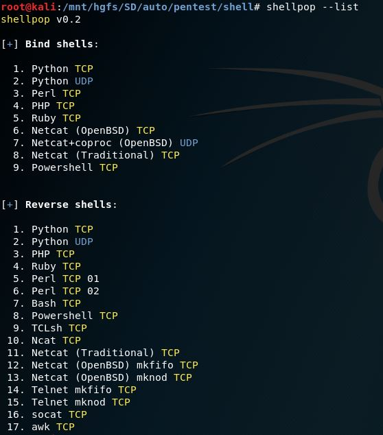

# ShellPop
## Pop shells like a master

## Installation
```bash
root@pc# ./install.sh
```

## List available code for shells
```bash
user@pc$ shellpop --list
```



## Generate code for RCE vulnerabilities


### Guide / Manual


### Types of Shell
There is two types of payloads in this program: Bind or Reverse.


#### Reverse Class
Reverse shells require, necessarily, --host and --port arguments.


#### Bind Class
Bind shells required, necessarily, only --port argument.


### Command line examples


### Generating a Python TCP reverse shell to IP 1.2.3.4 at port 443


### Generating a Python TCP reverse shell to IP 1.2.3.4 at port 443 but using URL-encoding, suitable to use over HTTP protocol.


### Generating a Python TCP reverse shell to IP 1.2.3.4 at port 443 but encode it to base64 and set-up a wrapper to decode it. This helps when quotes are troublesome.


### Generating a Python TCP reverse shell to IP 1.2.3.4 at port 443 URL-encoded and encoded to base64 ... Yes, you know the drill!


### Generating a Powershell bind shell over port 1337


### Generating a Powershell bind shell over port 1337 encoded in base64


## Credits

This code is 100% authored by Andre Marques (@zc00l) and it is made open to public the moment
it was released in his github. Any misuse of this code does not makes the author responsible
for the damage it could cause.

If you want to add more commands or improve my program, feel free to send me a pull request.
