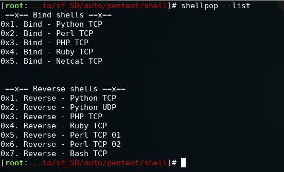

# ShellPop
## Pop shells like a master

## Installation
```bash
root@pc# ./install.sh
```

## List available code for shells
```bash
user@pc$ shellpop --list
```



## Generate code for RCE vulnerabilities

### Generate a bind shell of number 1, at port 3333.
```bash
user@pc$ shellpop --number 1 --bind --port 3333
```


## More examples


## Credits

This code is 100% authored by Andre Marques (@zc00l) and it is made open to public the moment
it was released in his github. Any misuse of this code does not makes the author responsible
for the damage it could cause.

If you want to add more commands or improve my program, feel free to send me a pull request.
